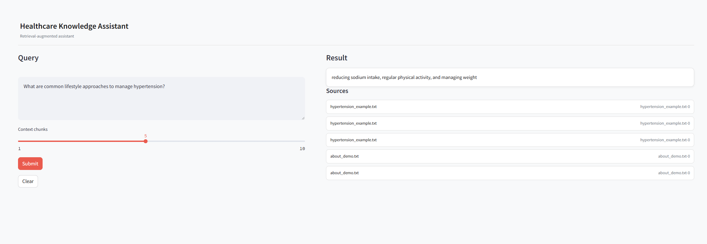

# MedAgent AI

A retrieval-augmented, multi-agent healthcare assistant.

## What this does
- Ingests text documents into a FAISS **vector database** using Sentence-Transformers embeddings.
- Runs a simple **multi-agent** pipeline:
  - Research Agent → retrieves top-k relevant chunks (RAG).
  - Summarization Agent → compresses retrieved text with a local Transformer (T5).
  - Compliance Agent → runs a basic safety/PII keyword screen.
- Serves a **FastAPI** backend and a **Streamlit** UI.
- Optional Docker setup. Minimal CI (pytest) included.



## Quickstart (local)
Requirements: Python 3.10+

1) Create and activate a venv
```
python -m venv .venv
# Windows: .venv\Scripts\activate
# macOS/Linux:
source .venv/bin/activate
```

2) Install deps
```
pip install -r requirements.txt
```

3) (First run) Ingest the sample docs
```
python backend/app/core/ingest.py
```

4) Start API
```
uvicorn backend.app.main:app --reload --port 8000
```

5) Start UI (new terminal)
```
streamlit run frontend/streamlit_app.py
```

Open http://localhost:8501

## Docker
```
docker compose up --build
```
- API: http://localhost:8000/docs
- UI:  http://localhost:8501

## Config
Copy `.env.example` to `.env` at project root if you want to change defaults.

## Tests
```
pytest -q
```

## Folder layout
```
medagent-ai/
  backend/app/
    core/ (embeddings, vector store, LLM, agents, RAG, ingest)
    data/knowledge/ (your .txt source files)
    data/index/ (FAISS index will be stored here)
    models/ (pydantic schemas)
    main.py (FastAPI app)
  frontend/streamlit_app.py (Streamlit UI)
  tests/ (smoke tests)
  requirements.txt
  docker-compose.yml
  Dockerfile.api
  Dockerfile.ui
  .env.example
```

## Notes
- Default models:
  - Embeddings: `sentence-transformers/all-MiniLM-L6-v2`
  - Summarizer/Generator: `google/flan-t5-base` (CPU-friendly; first run downloads weights)
- To use a different embedding or generation model, edit `backend/app/core/embeddings.py` and `backend/app/core/llm.py`.
- This demo keeps the compliance filter simple (keyword-based) to focus on system design.
